# Star Cars Management
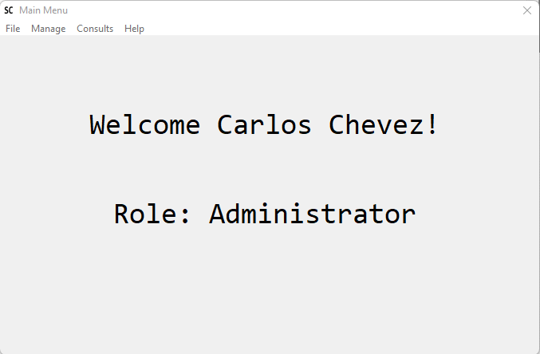

# About the App

This app shows some common VB6 features and controls. The idea of this app is to provide an example to showcase some of the solutions for VB6 migration and app modernization from [Mobilize.NET](https://www.mobilize.net).

# What can you see in this app

When the app starts, it will ask for credentials, depending on the user some options will not be available.

| User | Password | Level | Description |
| ---- | :----: | ---- | ---- |
| cchevez | test | Administrator | Allow to sell cars and add new employees |
| wmiller | test | Manager | Allow to add new employees |
| tpeters | test | Seller | Allow to sell cars |
| scarter | test | Disabled | Can not access the application |

There you can add new Brands, Vehicles, Employees or create a new receipt.

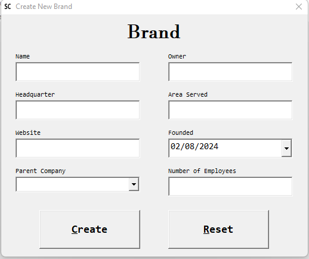

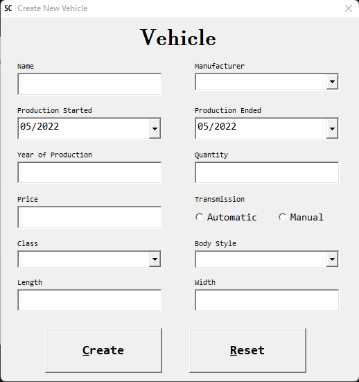

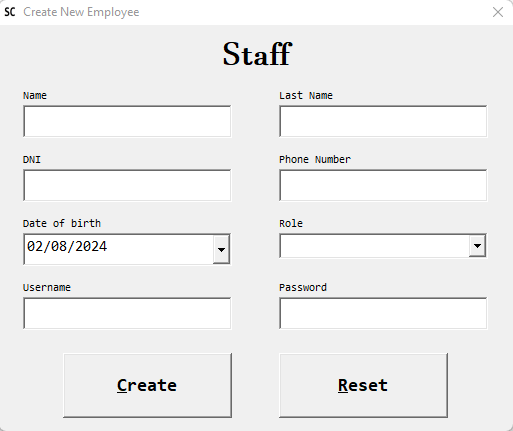

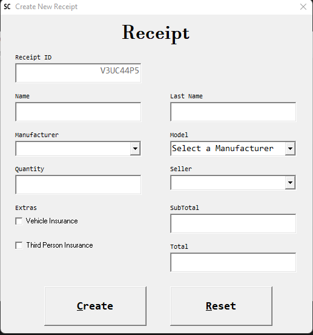

You can also delete Brands, Vehicles and Employees.

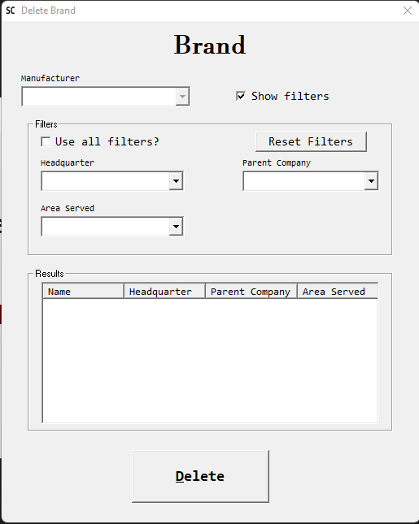

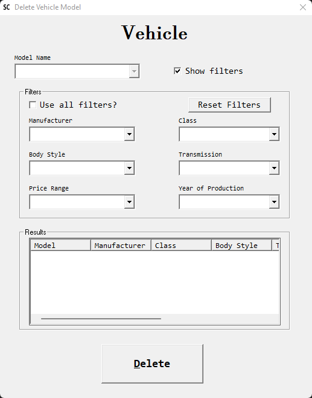

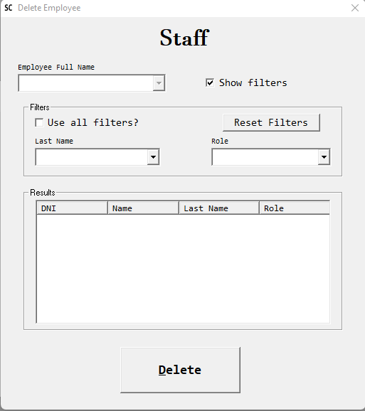

And finally, there are options to see all the information related to Brands, Vehicles, Employees and Receipts.

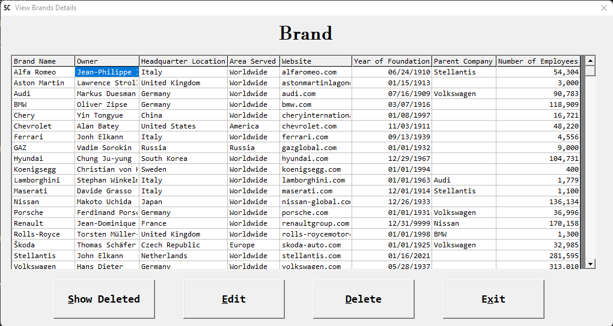

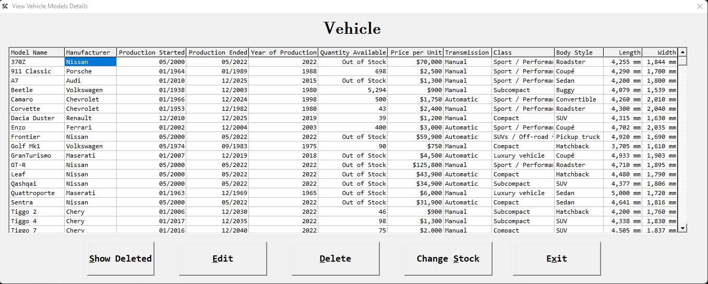

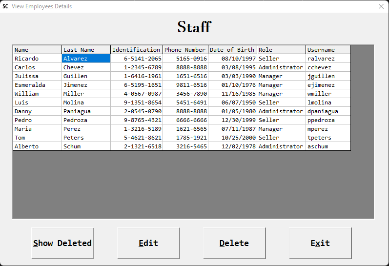

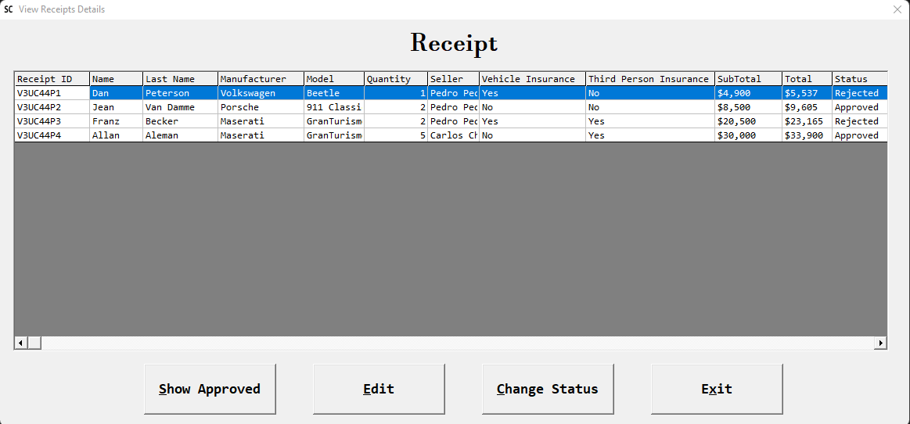

# Technologies used

This application was developed in VB6, it uses mostly the intrinsic VB6 controls.
- VB.Label
- VB.CommandButton
- VB.PictureBox
- VB.TextBox
- VB.CheckBox
- VB.Frame
- VB.Menu
- MSWLess.WLText
- MSWLess.WLCombo
- MSWLess.WLCommand
- MSWLess.WLCheck
- MSWLess.WLOption
- MSMask.MaskEdBox
- MSComCtl2.DTPicker
- MSComCtlLib.ListView
- MSFlexGridLib.MSFlexGrid

The database used is an **Access** Database called `database.mdb`

It uses *ADODB* to connect to this DB.